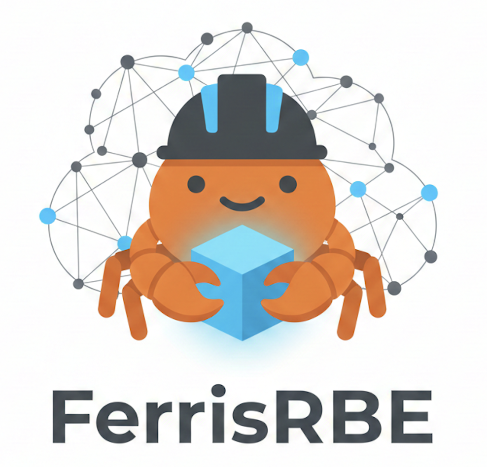

<p align="center">
  
</p>

<h1 align="center">FerrisRBE</h1>

<p align="center">
  <strong>A lean, predictable, and blazingly fast Remote Build Execution (RBE) server for Bazel, written in Rust.</strong>
</p>

<p align="center">
  <a href="https://github.com/xangcastle/ferrisrbe/actions"></a>
  <a href="https://github.com/xangcastle/ferrisrbe/blob/main/LICENSE"></a>
  <a href="https://github.com/bazelbuild/remote-apis"></a>
  <a href="#"></a>
</p>

---

## Why FerrisRBE?

Most RBE solutions are built on the JVM, requiring constant GC tuning and 4GB+ memory just to idle. When your build cache server needs its own dedicated node, something is wrong.

**FerrisRBE takes a different approach:**

* **Zero GC Pauses:** Rust's ownership model eliminates garbage collection. Predictable p99 latencies without JVM tuning.
* **O(1) Memory CAS Streaming:** Stream 10GB artifacts with constant ~50MB RAM usage. No more OOM kills during large uploads.
* **12-Factor by Default:** No XML, no YAML, no properties files. Just environment variables that operators already know how to manage.
* **Adaptive Resilience:** Workers auto-tune keepalive intervals based on network conditions. Transient failures don't fail builds.

## 🚀 Quick Start

### Option 1: Railway (Easiest - Remote Cache)

Deploy a managed Remote Cache instance with one click. Free tier available.

[](https://railway.com/deploy/mhjSM1?referralCode=yQR-JU)

```bash
# Or use CLI
railway service create ferrisrbe-cache --source .

# Configure Bazel with your Railway URL
echo 'build:remote --remote_cache=grpc://<your-railway-url>' >> ~/.bazelrc
```

**Note:** Railway provides Remote Cache only. For Remote Execution, use Option 2 or 3.

### Option 2: Cloud Development Environments

[](https://codespaces.new/xangcastle/ferrisrbe?quickstart=1)
[](https://gitpod.io/#https://github.com/xangcastle/ferrisrbe)

### Option 3: Docker Compose (Full RBE - Local)

Complete RBE stack with workers, cache, and execution on your machine.

```bash
git clone https://github.com/xangcastle/ferrisrbe.git
cd ferrisrbe
docker-compose up -d

# Configure Bazel
echo 'build:remote --remote_executor=grpc://localhost:9092' >> ~/.bazelrc
echo 'build:remote --remote_cache=grpc://localhost:9092' >> ~/.bazelrc
bazel build --config=remote //...
```

### Option 4: Kubernetes (Production)

```bash
# Helm install
helm install ferrisrbe oci://ghcr.io/xangcastle/ferrisrbe/charts/ferrisrbe \
  --namespace rbe --create-namespace

# Or with NodePort for local testing
helm install ferrisrbe oci://ghcr.io/xangcastle/ferrisrbe/charts/ferrisrbe \
  --namespace rbe --create-namespace \
  --set server.service.type=NodePort \
  --set server.service.nodePort=30092
```

## Architecture Highlights

FerrisRBE isn't a toy implementation; it's designed to handle the thundering herd of a massive monorepo CI pipeline.

* **Multi-Level Queuing:** Fast, medium, and slow queues automatically determined by action size. No more head-of-line blocking.
* **Lock-Free Concurrency:** Leveraging `DashMap` with 64 shards for L1 action cache and in-flight operations, ensuring high throughput without lock contention.
* **Event-Driven Workers:** Eliminates busy-waiting CPU cycles using `tokio::sync::Notify`. Your cluster's CPU is for building, not polling.
* **Smart Materialization:** Automatically degrades from zero-copy hardlinks to standard copies on `EXDEV` cross-device volume mounts (perfect for containerized executors).

### Resource Footprint

| Component | Memory (Idle) | Memory (Peak) | CPU (Idle) |
|-----------|---------------|---------------|------------|
| Server | ~45MB | ~150MB | ~0.01 cores |
| Worker | ~40MB | ~200MB per action | ~0.01 cores |

Compare to Java-based alternatives that idle at 500MB+ and spike to 4GB+ during GC.

## Quick Start

### 1. Configure Bazel

Add to your `.bazelrc`:

```bash
# Remote Cache (works from any OS)
build:remote-cache --remote_cache=grpc://localhost:9092
build:remote-cache --remote_upload_local_results=true

# Remote Execution (requires Linux toolchains)
build:remote-exec --config=remote-cache
build:remote-exec --remote_executor=grpc://localhost:9092
build:remote-exec --remote_default_exec_properties=OSFamily=linux
```

### 2. Build

```bash
# Cache only
bazel build --config=remote-cache //...

# Full remote execution
bazel build --config=remote-exec //...
```

### 3. Verify

```bash
# You should see "remote cache hit" and "remote" execution in the output
bazel build --config=remote //... 2>&1 | grep -E "(remote cache hit|processes)"
```

## Configuration

FerrisRBE strictly follows 12-Factor App methodology. No cryptic XML or YAML files required.

| Env Variable | Default | Description |
|--------------|---------|-------------|
| `RBE_PORT` | `9092` | Server listening port |
| `RBE_L1_CACHE_CAPACITY` | `100000` | Max entries in the in-memory action cache |
| `RBE_INLINE_OUTPUT_THRESHOLD` | `1048576` | Size (bytes) below which outputs are sent inline |
| `RBE_MAX_CONCURRENT_DOWNLOADS` | `10` | Concurrency limit for materializing execroots |

See [docs/configuration.md](docs/configuration.md) for the complete reference.

## Documentation

- [Architecture](docs/architecture.md) - System design and components
- [Deployment](docs/deployment.md) - Kubernetes, Helm, and Docker deployment
- [Configuration](docs/configuration.md) - Environment variables and tuning
- [Bazel Integration](docs/bazel-integration.md) - `.bazelrc` configuration
- [API Reference](docs/api.md) - REAPI v2.4 endpoints
- [Monitoring](docs/monitoring.md) - Metrics and logging
- [Troubleshooting](docs/troubleshooting.md) - Common issues and solutions

## Project Structure

```
ferrisrbe/
├── src/
│   ├── server/          # gRPC services (REAPI v2.4)
│   ├── execution/       # Scheduler, state machine, results
│   ├── worker/          # Worker registry and management
│   ├── cas/             # Content Addressable Storage backends
│   └── cache/           # L1 Action Cache (DashMap)
├── charts/              # Helm charts for Kubernetes
├── k8s/                 # Raw Kubernetes manifests
├── examples/            # Test projects (Bazel 7.4, 8.x, 9.x)
└── docs/                # Full documentation
```

## Roadmap

- [x] REAPI v2.4 Capabilities Service
- [x] Action merging (deduplication of identical in-flight actions)
- [x] HTTP/2 adaptive keepalive for resilient worker connections
- [ ] Persistent L2 Cache integration (Redis/Memcached)
- [ ] Prometheus / OpenTelemetry metrics exposition
- [ ] Web UI for build monitoring

## Contributing

PRs are welcome. We value:
- Clean abstractions
- Explicit error handling
- Comprehensive documentation
- Avoiding `unwrap()` in critical paths

See [docs/project-structure.md](docs/project-structure.md) for codebase orientation.

## License

[MIT](LICENSE)

---

<p align="center">
  Built with 🦀 for engineers who value predictability.
</p>
