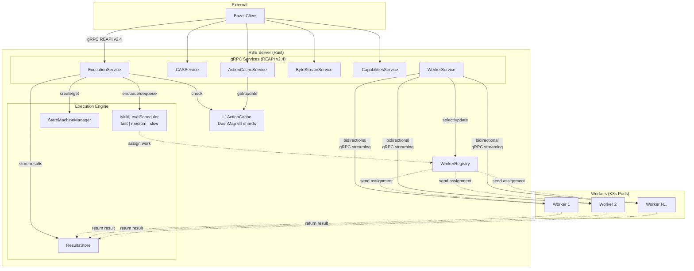

# Architecture

## Overview

FerrisRBE implements a distributed Remote Build Execution system using a server-worker architecture. The server handles API requests from Bazel clients and dispatches work to worker nodes.

## System Architecture



## Execution Flow

1. **Bazel** sends an action to `ExecutionService` via gRPC
2. **ExecutionService** creates a state machine via `StateMachineManager`
3. **L1ActionCache** is checked for existing results (cache hit short-circuits to response)
4. **MultiLevelScheduler** enqueues the action (Fast/Medium/Slow queue based on input size)
5. **ExecutionEngine** dispatcher dequeues the action and transitions state to `Assigned`
6. **WorkerRegistry** selects an available idle worker
7. **WorkerService** sends `WorkAssignment` to the worker via bidirectional gRPC stream
8. **Worker** executes the action and returns `ExecutionResult`
9. **ExecutionEngine** result processor stores the result in `ResultsStore`
10. State machine transitions to `Completed` or `Failed`, result is returned to Bazel

## Performance Characteristics

- **Zero GC Pauses**: Rust's ownership model eliminates garbage collection pauses
- **Lock-Free Concurrency**: DashMap with 64 shards for L1 cache
- **O(1) Memory CAS Streaming**: Handle 10GB+ artifacts without RAM spikes
- **Event-Driven Workers**: Uses `tokio::sync::Notify` instead of polling

## State Machine

Execution stages follow strict transitions:

```
CacheCheck → Queued → Assigned → Downloading → Executing → Uploading → Completed
     ↓            ↓          ↓            ↓           ↓           ↓
  Failed       Failed     Failed       Failed      Failed      Failed
```

## Multi-Level Scheduling

Actions are classified into three queues based on input size:

- **Fast Queue**: < 1MB input (interactive builds)
- **Medium Queue**: 1MB - 100MB (standard builds)
- **Slow Queue**: > 100MB (large artifact builds)

## Worker Communication

Workers maintain persistent bidirectional gRPC streams with the server:

- **Registration**: Workers identify themselves with capabilities
- **Heartbeats**: Keepalive mechanism with adaptive intervals
- **Work Assignment**: Server pushes work to available workers
- **Result Streaming**: Workers stream execution results back

### Persistent Worker Protocol Compliance

FerrisRBE fully implements Bazel's formal Persistent Worker protocol. Rather than simply recycling execution containers, FerrisRBE workers function as standard wrappers communicating via `stdin` and `stdout` using the `WorkRequest` and `WorkResponse` protocol buffers. This protocol compliance enables long-term retention of compiler state (such as warm JVMs and Abstract Syntax Trees) for sub-second incremental builds.

### Worker Sandboxing and Volume Mounting

FerrisRBE highly optimizes volume mounts using system hard links (`hard links`) to avoid deep copies and degrade gracefully. When enabling Bazel's `worker_sandboxing` directive, FerrisRBE actively bridges this separation. The hard link optimizations are safely bounded within the Sandbox namespace, preventing persistent workers from leaking internal compiler state through the filesystem while still offering maximum I/O performance.

## Related

- [Project Structure](./project-structure.md)
- [API Reference](./api.md)
